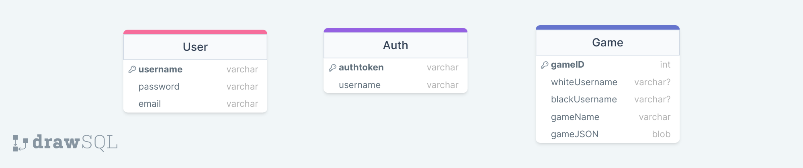

# ♕ BYU CS 240 Chess

This project demonstrates mastery of proper software design, client/server architecture, networking using HTTP and WebSocket, database persistence, unit testing, serialization, and security.

## SQL Design Diagram
[](https://drawsql.app/teams/team-2917/diagrams/chess)

## Server Design Sequence Diagram
[](https://sequencediagram.org/index.html#initialData=C4S2BsFMAIGEAtIGckCh0AcCGAnUBjEbAO2DnBElIEZVs8RCSzYKrgAmO3AorU6AGVIOAG4jUAEyzAsAIyxIYAERnzFkdKgrFIuaKlaUa0ALQA+ISPE4AXNABWAexDFoAcywBbTcLEizS1VZBSVbbVc9HGgnADNYiN19QzZSDkCrfztHFzdPH1Q-Gwzg9TDEqJj4iuSjdmoMopF7LywAaxgvJ3FC6wCLaFLQyHCdSriEseSm6NMBurT7AFcMaWAYOSdcSRTjTka+7NaO6C6emZK1YdHI-Qma6N6ss3nU4Gpl1ZkNrZwdhfeByy9hwyBA7mIT2KAyGGhuSWi9wuc0sAI49nyMG6ElQQA](https://sequencediagram.org/index.html?presentationMode=readOnly#initialData=IYYwLg9gTgBAwgGwJYFMB2YBQAHYUxIhK4YwDKKUAbpTngUSWOZVYSnfoccKQCLAwwAIIgQKAM4TMAE0HAARsAkoYMhZkwBzKBACu2GAGI0wKgE8YAJRRakEsFEFIIaYwHcAFkjAdEqUgBaAD4WakoALhgAbQAFAHkyABUAXRgAej0VKAAdNABvLMpTAFsUABoYXCl3aBlKlBLgJAQAX0wKcNgQsLZxKKhbe18oAAoiqFKKquUJWqh6mEbmhABKDtZ2GB6BIVFxKSitFDAAVWzx7Kn13ZExSQlt0PUosgBRABk3uCSYCamYAAzXQlP7ZTC3fYPbY9Tp9FBRNB6BAIDbULY7eRQw4wECDQQoc6US7FYBlSrVOZ1G5Y+5SJ5qBRRACSADl3lZfv8ydNKfNFssWjA2Ul4mDaHCMaFIXSJFE8SgCcI9GBPCTJjyaXtZQyXsL2W9OeKNeSYMAVZ4khAANbofWis0WiG0g6PQKwzb9R2qq22tBo+Ew0JwyLey029AByhB+DIdBgKIAJgADMm8vlzT6I2h2ugZJodPpDEZoLxjjAPhA7G4jF4fH440Fg6xQ3FEqkMiopC40Onuaa+XV2iGoCFJf0EFWkGh1VNyoOFutxygQjLXRFjmcLv2UFq7q6Qi93l8fsaAcCIKCJnlj99fguZECQcbndrXQAed0vHcU2b8gPsJ+gRrg8EQ-g+mjLmOnoIvYsR-nUACygggN4aBaKMS4wauLqgQqSoWrOmqvvuDyHkybIclyVw8vaYqZp4eSUYavwMb6doivRTogVIQEvGx2blDuAHiEBPFygJfqVMJI5AcuESSeg0k0WUmD+PGcktlAETRCmyZpPkMAAEQ7kZERGUZlRGYpaBmRZMC5mg+aFgYxg6CgdqVlo+jMLW3i+GpjbMB6XRRNEfCfG8SRvGk6RdhIPZ5DZUajsE8mTt5KqjDZWHouIOFvqBMgoAgJwoNlFrsWge7YhI5ERMVpW+GGVVPpeYYiSgYm4YccCXtgTUcLJ7ryX1JQDWVgUBGAmmhbpqZpPEADSmB5gWuiuUYgyPh8wwwAA4jyjx+fWU3xgyI5hftUWxVoPJJZV2YpRdMFRMgDiHWUEgVVmfq5YGmKFTiVDAMgci+Mqv3oD94Z-SRtW6ky5CRaeNkwAAYlY8SIWGMAAOoABKGm8LXZjAAC8MAAPzwzq7rNnlCIwAAaqDSD5suDLiUcJyfZIu0OJhtOuojrwo78ABUGNYzjd1fcL0L0707BHEdAtYJzSuXTAcv88Mz1K+pGA6XpBnGbrEhmTE+RGbrzJ8FbACMiYAMwACxWXWvhEiaKB2ZZxkKAgoDWj7Uz+1Zuusjy5lGa0MApI5+baBtxbYHoUATfA+LNXzHj+Q200vaFMQJMkt20Rmj1STrPLR2Uw5acX8LyjnKB8zDVWVFHxGa9KPVyjAINgwRUMzjlCv0j0eq3qj1d2pj2O44TxOk36FPU51XMD1E07ZGAHc92UNV088SPMUanG119MCjEfu4s8IHynG8ZC31TJ8i1rr3Xyg9tb9-Euds+AGx6EbBM819IwEMrbHk9snauzdg5VaTl1pFmMOYEqk53AwAAFIQGnAdWiRgg4hzOk2XorZYinA7OkXWD0x7pnAX1ScUBu5wL4I3LozcVYwAAFYELQB3Gy7Cyj2wpMHTBUAWHQH+lKGA3Mh5s3BigSGsNoYT3EqLZGJ5WLzzcIvHGDF8ZEysCTNGlMaZ9wUTvP42AVF81iJI4kwCJHACkTIqAn9FZnyiKcWIfBhDRV-o8d495nHSIgKwjeVMTGr2ATEyeboQot3IHoWUACUmhjIOk10oDQjgJNgtGAy0UHJxcsWHQ7jYyKlgMAbAA1CDOFcPnU64Dm6tgil8aKsV1AGwZqkkApU8C3CUCoIW1jFFDNqcIFEQstHTyRl0qKJNDHGgkAAbgUZFYJayLZbOWbsmWa90CbKSTGeSaSMmayydpK5eSRwxkKZAxaK01pAA)](https://sequencediagram.org/index.html?presentationMode=readOnly#initialData=IYYwLg9gTgBAwgGwJYFMB2YBQAHYUxIhK4YwDKKUAbpTngUSWOZVYSnfoccKQCLAwwAIIgQKAM4TMAE0HAARsAkoYMhZkwBzKBACu2GAGI0wKgE8YAJRRakEsFEFIIaYwHcAFkjAdEqUgBaAD4WakoALhgAbQAFAHkyABUAXRgAej0VKAAdNABvLMpTAFsUABoYXCl3aBlKlBLgJAQAX0wKcNgQsLZxKKhbe18oAAoiqFKKquUJWqh6mEbmhABKDtZ2GB6BIVFxKSitFDAAVWzx7Kn13ZExSQlt0PUosgBRABk3uCSYCamYAAzXQlP7ZTC3fYPbY9Tp9FBRNB6BAIDbULY7eRQw4wECDQQoc6US7FYBlSrVOZ1G5Y+5SJ5qBRRACSADl3lZfv8ydNKfNFssWjA2Ul4mDaHCMaFIXSJFE8SgCcI9GBPCTJjyaXtZQyXsL2W9OeKNeSYMAVZ4khAANbofWis0WiG0g6PQKwzb9R2qq22tBo+Ew0JwyLey029AByhB+DIdBgKIAJgADMm8vlzT6I2h2ugZJodPpDEZoLxjjAPhA7G4jF4fH440Fg6xQ3FEqkMiopC40Onuaa+XV2iGoCFJf0EFWkGh1VNyoOFutxygQjLXRFjmcLv2UFq7q6Qi93l8fsaAcCIKCJnlj99fguZECQcbndrXQAed0vHcU2b8gPsJ+gRrg8EQ-g+mjLmOnoIvYsR-nUACygggN4aBaKMS4wauLqgQqSoWrOmqvvuDyHkybIclyVw8vaYqZp4eSUYavwMb6doivRTogVIQEvGx2blDuAHiEBPFygJfqVMJI5AcuESSeg0k0WUmD+PGcktlAETRCmyZpPkMAAEQ7kZERGUZlRGYpaBmRZMC5mg+aFgYxg6CgdqVlo+jMLW3i+GpjbMB6XRRNEfCfG8SRvGk6RdhIPZ5DZUajsE8mTt5KqjDZWHouIOFvqBMgoAgJwoNlFrsWge7YhI5ERMVpW+GGVVPpeYYiSgYm4YccCXtgTUcLJ7ryX1JQDWVgUBGAmmhbpqZpPEADSmB5gWuiuUYgyPh8wwwAA4jyjx+fWU3xgyI5hftUWxVoPJJZV2YpRdMFRMgDiHWUEgVVmfq5YGmKFTiVDAMgci+Mqv3oD94Z-SRtW6ky5CRaeNkwAAYlY8SIWGMAAOoABKGm8LXZjAAC8MAAPzwzq7rNnlCIwAAaqDSD5suDLiUcJyfZIu0OJhtOuojrwo78ABUGNYzjd1fcL0L0707BHEdAtYJzSuXTAcv88Mz1K+pGA6XpBnGbrEhmTE+RGbrzJ8FbACMiYAMwACxWXWvhEiaKB2ZZxkKAgoDWj7Uz+1Zuusjy5lGa0MApI5+baBtxbYHoUATfA+LNXzHj+Q200vaFMQJMkt20Rmj1STrPLR2Uw5acX8LyjnKB8zDVWVFHxGa9KPVyjAINgwRUMzjlCv0j0eq3qj1d2pj2O44TxOk36FPU51XMD1E07ZGAHc92UNV088SPMUanG119MCjEfu4s8IHynG8ZC31TJ8i1rr3Xyg9tb9-Euds+AGx6EbBM819IwEMrbHk9snauzdg5VaTl1pFmMOYEqk53AwAAFIQGnAdWiRgg4hzOk2XorZYinA7OkXWD0x7pnAX1ScUBu5wL4I3LozcVYwAAFYELQB3Gy7Cyj2wpMHTBUAWHQH+lKGA3Mh5s3BigSGsNoYT3EqLZGJ5WLzzcIvHGDF8ZEysCTNGlMaZ9wUTvP42AVF81iJI4kwCJHACkTIqAn9FZnyiKcWIfBhDRV-o8d495nHSIgKwjeVMTGr2ATEyeboQot3IHoWUACUmhjIOk10oDQjgJNgtGAy0UHJxcsWHQ7jYyKlgMAbAA1CDOFcPnU64Dm6tgil8aKsV1AGwZqkkApU8C3CUCoIW1jFFDNqcIFEQstHTyRl0qKJNDHGgkAAbgUZFYJayLZbOWbsmWa90CbKSTGeSaSMmayydpK5eSRwxkKZAxaK01pAA )


Here is the backup url in case the embedded link broke.
https://sequencediagram.org/index.html?presentationMode=readOnly#initialData=IYYwLg9gTgBAwgGwJYFMB2YBQAHYUxIhK4YwDKKUAbpTngUSWOZVYSnfoccKQCLAwwAIIgQKAM4TMAE0HAARsAkoYMhZkwBzKBACu2GAGI0wKgE8YAJRRakEsFEFIIaYwHcAFkjAdEqUgBaAD4WakoALhgAbQAFAHkyABUAXRgAej0VKAAdNABvLMpTAFsUABoYXCl3aBlKlBLgJAQAX0wKcNgQsLZxKKhbe18oAAoiqFKKquUJWqh6mEbmhABKDtZ2GB6BIVFxKSitFDAAVWzx7Kn13ZExSQlt0PUosgBRABk3uCSYCamYAAzXQlP7ZTC3fYPbY9Tp9FBRNB6BAIDbULY7eRQw4wECDQQoc6US7FYBlSrVOZ1G5Y+5SJ5qBRRACSADl3lZfv8ydNKfNFssWjA2Ul4mDaHCMaFIXSJFE8SgCcI9GBPCTJjyaXtZQyXsL2W9OeKNeSYMAVZ4khAANbofWis0WiG0g6PQKwzb9R2qq22tBo+Ew0JwyLey029AByhB+DIdBgKIAJgADMm8vlzT6I2h2ugZJodPpDEZoLxjjAPhA7G4jF4fH440Fg6xQ3FEqkMiopC40Onuaa+XV2iGoCFJf0EFWkGh1VNyoOFutxygQjLXRFjmcLv2UFq7q6Qi93l8fsaAcCIKCJnlj99fguZECQcbndrXQAed0vHcU2b8gPsJ+gRrg8EQ-g+mjLmOnoIvYsR-nUACygggN4aBaKMS4wauLqgQqSoWrOmqvvuDyHkybIclyVw8vaYqZp4eSUYavwMb6doivRTogVIQEvGx2blDuAHiEBPFygJfqVMJI5AcuESSeg0k0WUmD+PGcktlAETRCmyZpPkMAAEQ7kZERGUZlRGYpaBmRZMC5mg+aFgYxg6CgdqVlo+jMLW3i+GpjbMB6XRRNEfCfG8SRvGk6RdhIPZ5DZUajsE8mTt5KqjDZWHouIOFvqBMgoAgJwoNlFrsWge7YhI5ERMVpW+GGVVPpeYYiSgYm4YccCXtgTUcLJ7ryX1JQDWVgUBGAmmhbpqZpPEADSmB5gWuiuUYgyPh8wwwAA4jyjx+fWU3xgyI5hftUWxVoPJJZV2YpRdMFRMgDiHWUEgVVmfq5YGmKFTiVDAMgci+Mqv3oD94Z-SRtW6ky5CRaeNkwAAYlY8SIWGMAAOoABKGm8LXZjAAC8MAAPzwzq7rNnlCIwAAaqDSD5suDLiUcJyfZIu0OJhtOuojrwo78ABUGNYzjd1fcL0L0707BHEdAtYJzSuXTAcv88Mz1K+pGA6XpBnGbrEhmTE+RGbrzJ8FbACMiYAMwACxWXWvhEiaKB2ZZxkKAgoDWj7Uz+1Zuusjy5lGa0MApI5+baBtxbYHoUATfA+LNXzHj+Q200vaFMQJMkt20Rmj1STrPLR2Uw5acX8LyjnKB8zDVWVFHxGa9KPVyjAINgwRUMzjlCv0j0eq3qj1d2pj2O44TxOk36FPU51XMD1E07ZGAHc92UNV088SPMUanG119MCjEfu4s8IHynG8ZC31TJ8i1rr3Xyg9tb9-Euds+AGx6EbBM819IwEMrbHk9snauzdg5VaTl1pFmMOYEqk53AwAAFIQGnAdWiRgg4hzOk2XorZYinA7OkXWD0x7pnAX1ScUBu5wL4I3LozcVYwAAFYELQB3Gy7Cyj2wpMHTBUAWHQH+lKGA3Mh5s3BigSGsNoYT3EqLZGJ5WLzzcIvHGDF8ZEysCTNGlMaZ9wUTvP42AVF81iJI4kwCJHACkTIqAn9FZnyiKcWIfBhDRV-o8d495nHSIgKwjeVMTGr2ATEyeboQot3IHoWUACUmhjIOk10oDQjgJNgtGAy0UHJxcsWHQ7jYyKlgMAbAA1CDOFcPnU64Dm6tgil8aKsV1AGwZqkkApU8C3CUCoIW1jFFDNqcIFEQstHTyRl0qKJNDHGgkAAbgUZFYJayLZbOWbsmWa90CbKSTGeSaSMmayydpK5eSRwxkKZAxaK01pAA


## 10k Architecture Overview

The application implements a multiplayer chess server and a command line chess client.

[](https://sequencediagram.org/index.html#initialData=C4S2BsFMAIGEAtIGckCh0AcCGAnUBjEbAO2DnBElIEZVs8RCSzYKrgAmO3AorU6AGVIOAG4jUAEyzAsAIyxIYAERnzFkdKgrFIuaKlaUa0ALQA+ISPE4AXNABWAexDFoAcywBbTcLEizS1VZBSVbbVc9HGgnADNYiN19QzZSDkCrfztHFzdPH1Q-Gwzg9TDEqJj4iuSjdmoMopF7LywAaxgvJ3FC6wCLaFLQyHCdSriEseSm6NMBurT7AFcMaWAYOSdcSRTjTka+7NaO6C6emZK1YdHI-Qma6N6ss3nU4Gpl1ZkNrZwdhfeByy9hwyBA7mIT2KAyGGhuSWi9wuc0sAI49nyMG6ElQQA)

## IntelliJ Support

Open the project directory in IntelliJ in order to develop, run, and debug your code using an IDE.

## Maven Support

You can use the following commands to build, test, package, and run your code.

| Command                    | Description                                     |
| -------------------------- | ----------------------------------------------- |
| `mvn compile`              | Builds the code                                 |
| `mvn package`              | Run the tests and build an Uber jar file        |
| `mvn package -DskipTests`  | Build an Uber jar file                          |
| `mvn install`              | Installs the packages into the local repository |
| `mvn test`                 | Run all the tests                               |
| `mvn -pl shared tests`     | Run all the shared tests                        |
| `mvn -pl client exec:java` | Build and run the client `Main`                 |
| `mvn -pl server exec:java` | Build and run the server `Main`                 |

These commands are configured by the `pom.xml` (Project Object Model) files. There is a POM file in the root of the project, and one in each of the modules. The root POM defines any global dependencies and references the module POM files.

### Running the program using Java

Once you have compiled your project into an uber jar, you can execute it with the following command.

```sh
java -jar client/target/client-jar-with-dependencies.jar

♕ 240 Chess Client: chess.ChessPiece@7852e922
```
